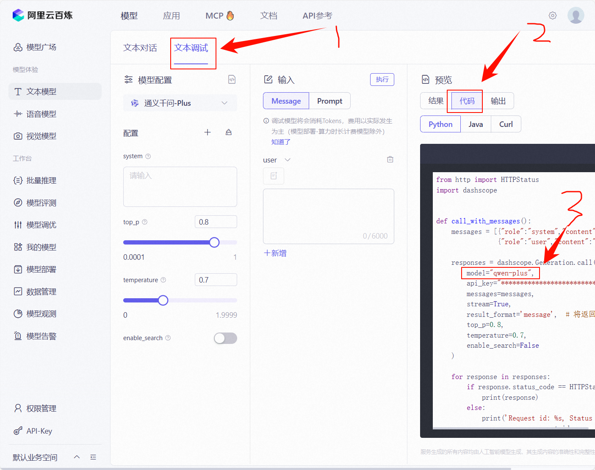

# Yatori-go-console
Hello，欢迎来到yatori系列yatori-go-console，此项目采用GO语言开发，基于yatori-go-core核心

## 🎯 目前支持平台：

| 平台              | 描述                                   | 状态        |
| ----------------- | -------------------------------------- | ----------- |
| 英华学堂           | 支持暴力模式（会被检测到）              | 已完成 ✅    |
| 仓辉实训           | 支持暴力模式（套壳英华版本会被检测到）        | 已完成 ✅    |
| 创能实训           | 支持暴力模式（会被检测到）              | 已完成 ✅    |
| 社会公益课          | 支持暴力模式（会被检测到）              | 已完成 ✅    |
| 重庆工业学院CQIE     | 支持暴力模式（支持秒刷）               | 已完成 ✅    |
| 学习公社（ENAEA）    | 支持暴力模式（倍速刷）                | 已完成 ✅    |
| 大学生网络党校（ENAEA） | 支持暴力模式（倍速刷）                | 已完成 ✅    |
| 中小学网络党校（ENAEA） | 支持暴力模式（倍速刷）                | 已完成 ✅    |
| 学习通            | 支持绕过人脸认证，支持暴力模式（暴力模式大概率打回） | 已完成 ✅    |
| 码上研训           | 默认秒刷                       | 已完成 ✅    |
| MOOC        | 无                          | 开发中 🚧    |
| 智慧树            | 无                                     | 开发中 🚧    |
| 学习公社（TTCDW） | 无                                     | 开发中 🚧    |
| 工学云打卡        | （Core已完成待整合）                   | 完成度80% 🚧 |

::: tip
其中`已完成 ✅`指标已最基础的支持视屏学习为基准，`开发中 🚧`代表正在开发中...
:::


## 🎯 适配的题库：

| 题库平台                |
| ----------------- | 
| [言溪题库](https://tk.enncy.cn/)           |
| [MAX题库](https://tkwz.xyz/)           |


## 🚀 下载和使用方式（给小白看的）
### 第一步从官网下载最新版本压缩包
#### 1、Home跳转主页，并点击获取可跳转至github（部分地区可能要梯子）

#### 2、获取最新版本文件

#### 3、下载对应平台压缩包
::: tip
注意：这里框了两个，带linux字眼的是linux系统用的，带windows字眼是windows系统用的，别搞错了
:::


### 第二步解压下载好的最新版本


### 第三步编辑配置文件
1、这里是推荐使用vscode等其他编程软件编辑，当然也可以用文本编辑器。没有文本编辑器的也可以用[网页版在线vscode](https://vscode.dev)

2、将最主要的平台类型以及url链接和账号密码填写好之后保存（其他配置自行参考[配置文件填写说明](#🚀-配置文件填写说明)）


3、当然如果你任然不明白怎么填写，也可以使用配置文件生成器来根据你填写的表单自动生成配置文件[点击跳转配置文件生成器](https://yatori-dev.github.io/yatori-config-generate/)
v

### 第四步启动yatori


如果出现以下大概内容说明成功启动了，之后你只需要挂着就行


## 🚀 配置文件填写说明
::: tip
注意，配置文件为config.yaml文件，此文件必须要与yatori-go-console在相同目录下才可让程序正常读取到
:::
```markdown
setting:
  basicSetting:
    completionTone: 1 #是否开启完成提示音，0为关闭，1为开启
    colorLog: 1 #是否开启彩色日志，0为关闭，1为开启，如果控制台乱码可以尝试改为0关闭
    logOutFileSw: 1 #是否开启日志文件输出，0为关闭，1为开启
    logLevel: "INFO" #日志类型，一般INFO即可
    logModel: 0 #日志输出模式，0为以视屏提交学时为单位进行日志输出，1为以课程信息为单位进行输出
    ipProxySw: 0 #是否开启IP代理，0代表关闭，1代表开启，开启后一定要子当前启动目录下创建ip.txt这个ip池文件，里面填写对应的代理IP即可，一行一个。注意，代理的IP一定要支持Https
  aiSetting:
    aiType: "TONGYI" #智普：CHATGLM、星火：XINGHUO、通义千问：TONGYI、豆包：DOUBAO、其他模型：OTHER
    aiUrl: "" #默认不填，除非你用的不是上面所指明的AI模型，比如ChatGPT
    model: "" #AI模型，不填则使用yatori默认选择的模型，如果你用的豆包则必填并且填的是接入点ID非模型名称，比如ep-2024xxxxx
    API_KEY: "" #AI平台对应的apikey
users:
  - accountType: "YINGHUA" #平台类型，英华学堂：YINGHUA、仓辉：CANGHUI、学习公社：ENAEA、学习通：XUEXITONG、重庆工业学院：CQIE
    url: "url" #对应平台的url链接,学习公社、CQIE、学习通可以不用填且可以直接把这一行去掉
    account: "账号" #账号
    password: "密码" #密码
    coursesCustom:
      cxNode: 3 # 这个是在学习通下videoModel模式为3时才会生效，代表多任务点模式下同时进行多少个任务点一起学，如果填写-1则表示所有任务点同时一起学（学习通多任务点模式请谨慎使用）
      videoModel: 1 #刷视屏模式，0代表不刷，1代表普通模式，2代表暴力模式
      autoExam: 0 #是否自动考试，0代表不考试，1代表考试
      examAutoSubmit: 1 #是否考完试自动提交试卷，0代表不自动提交，1代表自动提交
      includeCourses: []  #include和exclude填一个即可，include代表只有这里面的课程才刷，填课程名称，比如["xxxx","xxxx"]，学习公社填必修课程或者选修课程等
      excludeCourses: []  #include和exclude填一个即可，exclude代表除了这里面的课程其他都刷，填课程名称，比如["xxxx","xxxx"]，学习公社填必修课程或者选修课程等
```


## 🚀 添加多个账号模板例子

```markdown
setting:
  basicSetting:
    completionTone: 1
    colorLog: 1
    logOutFileSw: 1
    logLevel: "INFO"
    logModel: 0
    ipProxySw: 0
  aiSetting:
    aiType: "TONGYI"
    aiUrl: ""
    model: ""
    API_KEY: ""
users:
  - accountType: "YINGHUA" # 英华学堂 or 套壳仓辉
    url: "https://mooc.xxx.com"
    account: "123456"
    password: "114514"
    coursesCustom:
      videoModel: 1 # 开启视屏学习
      autoExam: 0 # 关闭AI答题
      examAutoSubmit: 1 # 自动提交试卷
      includeCourses: []
      excludeCourses: []
  - accountType: "CQIE" # 重庆工程学院CQIE
    account: "1888282231" # CQIE和学习公社可以不用url
    password: "114514"
    coursesCustom:
      videoModel: 1 # 开启视屏学习
      autoExam: 0
      examAutoSubmit: 1 # 自动提交试卷
      includeCourses: []
      excludeCourses: []
```

## 🚀 智慧职教如何使用Cookie登录

1、首先进入智慧职教首页，并点击进入[登录页面](https://sso.icve.com.cn/sso/auth?mode=simple&redirect=https%3A%2F%2Fwww.icve.com.cn%2Fpedding&source=25)。

2、登录过后打开开发者工具,点击如下图按钮打开。


3、然后调到网络选项栏，并`刷新`智慧职教网页。

4、找到`index`页面数据，然后复制`Cookie`数据，智慧将其粘贴到配置文件的`password`字段中即可。


```yaml
setting:
  basicSetting:
    completionTone: 1
    colorLog: 1
    logOutFileSw: 1
    logLevel: "INFO"
    logModel: 0
  aiSetting:
    aiType: "TONGYI"
    aiUrl: "" 
    model: "" 
    API_KEY: ""
  apiQueSetting:
    url: "http://localhost:8083"
users:
  - accountType: "ICVE"
    url: ""
    account: "账号"
    password: "填写刚才复制的Cookie"
    isProxy: 0
    coursesCustom:
      weLearnTime: 10-30
      shuffleSw: 0
      videoModel: 1
      autoExam: 0
    examAutoSubmit: 1
    includeCourses: []
    excludeCourses: []
```


## 🚀 关于如何接入通义千问大模型答题
因为该软件目前支持OpenAI规范接入格式，所以只要适配了OpenAI对接API范式的模型都可以直接接入使用，通义千问也是如此。

1、第一步：
* 接入通义千问你只需要先去[百炼控制台](https://bailian.console.aliyun.com)登录后选择一个模型，这里我就选择通义的Plus-Latest模型（注意！！！一定要是文本大模型，其他什么图片生成模型啥的都不行！！！）


2、第二步：
* 进入过后根据自己选择的模型然后点击立即体验


* 然后点击`文本调试`-->`代码`,下图中圈出来的`model`参数就是我们需要填到配置文件里面`model`的参数




3、第三步：
* 点击`API-Key`创建对接秘钥


* 然后粘贴到`config.yaml`配置文件对应项就行


之后就就可以愉快的答题了，答题前请确保账号有足够额度答题，一般情况下新账号都有免费额度的。


## 🚀 关于如何接入豆包大模型答题
因为该软件目前支持OpenAI规范接入格式，所以只要适配了OpenAI对接API范式的模型都可以直接接入使用，豆包也是如此。（在使用前请确保AI账号有足够额度）

1、第一步：
* 接入豆包你需要先去[火山方舟平台](https://console.volcengine.com/ark/region:ark+cn-beijing/experience/chat?id=excs-202509032005-[3XpiSG5OcNLDT51PqYVD_])登录并获取API-KEY。

2、登录好后去控制台获取API-KEY

复制好后填入config对应账号项的`API-KEY`里面


3、然后选择你想要对接的模型，然后选择API对接


4、点击开通模型，然后选择复制对应模型然后粘贴到对应config文件内的model项里面即可。


好了，现在就可以正常使用豆包答题了。

## 🚀 关于如何接入Deepseek大模型答题
因为该软件目前支持OpenAI规范接入格式，所以只要适配了OpenAI对接API范式的模型都可以直接接入使用，Deepseek也是如此。（在使用前请确保AI账号有足够额度）

1、第一步：

* 接入Deepseek你只需要先去[Deepseek开放平台](https://platform.deepseek.com/api_keys)获取API-KEY。


2、第二步：
* 之后你只需要需要把获取到的API-key配置到config.yml文件内的AI配置项里面即可。以下为配置模板样式：
```yml
setting:
  basicSetting:
    completionTone: 1
    colorLog: 1
    logOutFileSw: 1
    logLevel: "INFO"
    logModel: 0 
    ipProxySw: 0 
  aiSetting:
    aiType: "OTHER" # Deepseek的话填OTHER
    aiUrl: "https://api.deepseek.com/chat/completions" # 这条固定写法
    model: "deepseek-chat" # Deepseek目前只支持这个模型，新模型后续支持
    API_KEY: "sk-39******a1" #注意！！替换为Deepseek你账户的的API-KEY
users:
  - accountType: "YINGHUA"
    url: "https://mooc.xxx.cn/" # 对应你学校平台url
    account: "*****" # 账号
    password: "*****" #密码
    coursesCustom:
      videoModel: 1
      autoExam: 1
      includeCourses: []
      excludeCourses: []
```


## 🚀 关于如何启用IP代理服务

### 使用自己的机场代理

这里我以Clash verge为例，机场自行配置。
首先在clash中开启并查看对应http代理端口是什么


然后在同yatori的exe文件同目录下创建ip.txt文件，并且在里面填写对应代理url


之后再在对应用户配置下`ipProxy`开启IP代理设置即可

```yaml
setting:
  basicSetting:
    completionTone: 1
    colorLog: 1
    logOutFileSw: 1
    logLevel: "INFO"
    logModel: 0
  aiSetting:
    aiType: "TONGYI"
    aiUrl: ""
    model: ""
    API_KEY: ""
  apiQueSetting:
    url: "http://localhost:8083"
users:
 - accountType: "YINGHUA"
   url: "https://xxx.qiankj.com"
   account: "114514"
   password: "******"
   isProxy: 1 # 0代表关闭此用户代理，1代表开启此用户代理
   coursesCustom:
     videoModel: 1
     autoExam: 0
     examAutoSubmit: 0
     includeCourses: ["《3D绘图与制作》"]
     excludeCourses: []
```

完成后直接双击`start.bat`启动即可

### 使用网上的代理IP

使用网上的ip代理也是一样的操作，只需要改变ip.txt里面的代理url即可,之后直接开启`isPorxy`然后启动`start.bat`


## ❓ 关于报错Platform-specific initialization failed解决
* 若出现以下情况报错，可能因为系统缺失相关DLL库导致的问题，此情况多发生在windows server系统。


* 出现此类报错可能是可能是缺少相关C++库VC_redist导致，一般下载[点击此处下载](https://aka.ms/vs/17/release/VC_redist.x64.exe)完对应库安装后就可解决。


## ❓关于Linux系统版本运行报错问题
* 若出现`error while loading shared libraries: libasound.so.2: cannot open shared object file: No such file or directory`报错
* 此报错是因为Linux未安装音频库造成的，常出现在只有控制台界面的Linux当中，所以只需要安装对应libasound库就行

Ubuntu:
```shell
sudo apt update
sudo apt install libasound2
```

CentOS:
```shell
sudo yum install alsa-lib
```

Arch Linux:
```shell
sudo pacman -S alsa-lib
```