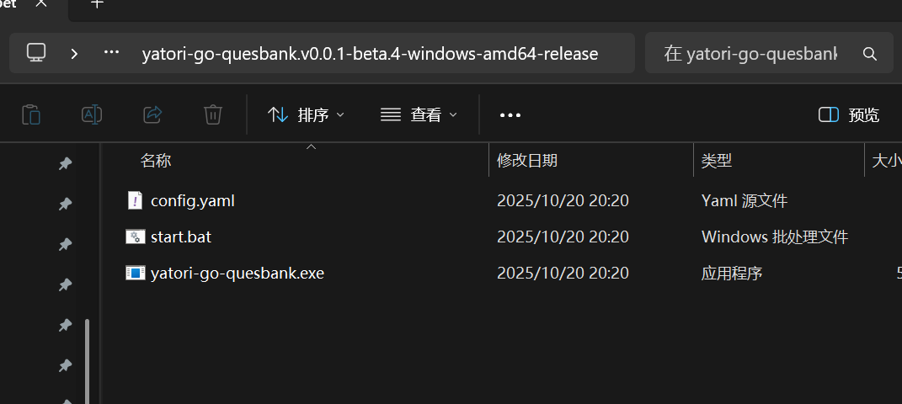

# yatori-go-quesbank使用教程
---


## 1 关于yatori-go-quesbank
yatori-go-quesbank是一个用于收集题库的工具，他搭配了ElasticSearch本地缓存以及AI答题以及三方题库等集成，拥有多样化的题目搜索功能，在一定程度上保证了答题的正确性以及题库采集和搜索机制。

## 2 快速入门quesbank

### 2.1 下载quesbank项目
首先进入对应项目[Github页面](https://github.com/yatori-dev/yatori-go-quesbank)，然后点击release，


之后我们会看到对应的下载文件，这里我们根据实际情况进行下载，其中带有linux字样的是linux系统使用的版本，带有windows字样的是windows系统使用的版本，请根据你所使用的系统点击相关条目进行下载，这里我已windows系统版本为例：


下载好后，我们将其找个地方解压，解压后我们可以看到以下这三个文件，其中config为配置文件，这个使用过[yatori-go-console](https://github.com/yatori-dev/yatori-go-console)的同学应该都知道。然后就是start.bat文件，这个文件就是后续我们配置好后双击进行启动的文件。而yatori-go-quesbank.exe则是我们题库程序本体：


### 2.2 修改配置文件
这里推荐是使用vscode去等有高亮显示的程序去修改，虽然也可以以文本形式打开然后修改，但是不是很推荐，主要是没有高亮很容易写错，当然如果嫌下载vscode麻烦的也可以暂时先用[vscode](https://vscode.dev/?vscode-lang=zh-cn)在线网页版本去编辑，效果如下图：


#### 2.2.1 添加AI答题配置
关键参数说明，`#`后面的中文即是对前面参数的说明，比如`aiType`字段中，`aiType: "TONGYI"`代表你选择的AI是通义千问，如果是`aiType: "DOUBAO"`则代表你选择的AI是豆包
```yaml
# AI答题模板---------------------------------------------------------------------
- answerType: AI  #代表该配置为AI答题，固定写法
  answerLabel: "" #该题库配置的唯一标签标识，随便你怎么填写，但是不得与其他标签重复
  aiType: "TONGYI" #智普：CHATGLM、星火：XINGHUO、通义千问：TONGYI、豆包：DOUBAO、秘塔AI：METAAI、其他模型：OTHER
  aiUrl: "" #默认不填，除非你用的不是上面所指明的AI模型，比如ChatGPT
  aiModel: "" #AI模型，不填则使用yatori默认选择的模型，如果你用的豆包则必填并且填的是接入点ID非模型名称，比如ep-2024xxxxx
  API_KEY: "" #AI平台对应的apikey
  cacheTargetList: [] # 缓存目标，如果搜到题目则缓存到指定answerLabel标签的题库里面（注意对应标签的题库只能是Sqlite类型或ES类型）
```

以下是添加单个AI配置的例子，这里以通义千问为例子：
```yaml
setting:
  basicSetting:
    logOutFileSw: 0
    logLevel: INFO
    cacheTarget: "es1"
    defaultSqlitePath: "./db/default.db" #默认Sqlite数据库路径，非必要不要乱动
    defaultEsUrl: "http://localhost:9200" #默认ES的Url，非必要不要乱动
  answerSetting:
    - answerType: AI
      answerLabel: "通义千问"
      aiType: "TONGYI"
      aiUrl: ""
      aiModel: ""
      API_KEY: "sk-92ndk2kcn2lvlxmxjb2"
      cacheTargetList: []
```

以下是豆包为例子：
```yaml
setting:
  basicSetting:
    logOutFileSw: 0
    logLevel: INFO
    cacheTarget: "es1"
    defaultSqlitePath: "./db/default.db" #默认Sqlite数据库路径，非必要不要乱动
    defaultEsUrl: "http://localhost:9200" #默认ES的Url，非必要不要乱动
  answerSetting:
    - answerType: AI
      answerLabel: "豆包"
      aiType: "DOUBAO"
      aiUrl: ""
      aiModel: "doubao-aslfjlv"
      API_KEY: "sk-92ndk2kcn2lvlxmxjb2"
      cacheTargetList: []
```
关于相关参数的配置可以参考[yatori-go-console Docs](https://yatori-dev.github.io/yatori-docs/yatori-go-console/docs.html#%F0%9F%9A%80-%E5%85%B3%E4%BA%8E%E5%A6%82%E4%BD%95%E6%8E%A5%E5%85%A5%E9%80%9A%E4%B9%89%E5%8D%83%E9%97%AE%E5%A4%A7%E6%A8%A1%E5%9E%8B%E7%AD%94%E9%A2%98)的AI配置部分说明


### 2.2.2 添加言溪题库配置
首先进入[言溪题库官网](https://tk.enncy.cn/)，并登录。登录好后点击个人中心，然后点击更多配置，然后复制token。


复制完后，我们返回配置文件对配置文件进行修改，以下为三方题库配置关键参数说明：

```yaml
# 三方题库模板--------------------------------------------------------------------
- answerType: EXTERNAL #代表该配置为外置三方题库，固定写法
  answerLabel: "" #该题库配置的唯一标签标识，随便你怎么填写，但是不得与其他标签重复
  exType: MAX  #这里填的外挂题库的类型，目前支持：MAX（max题库），YANXI（言溪题库）
  exToken: ""  #题库Token
  cacheTargetList: [] # 缓存目标，如果搜到题目则缓存到指定answerLabel标签的题库里面（注意对应标签的题库只能是Sqlite类型或ES类型）
```

以下为添加单个言溪题库的例子：
```yaml
setting:
  basicSetting:
    logOutFileSw: 0
    logLevel: INFO
    cacheTarget: "es1"
    defaultSqlitePath: "./db/default.db" #默认Sqlite数据库路径，非必要不要乱动
    defaultEsUrl: "http://localhost:9200" #默认ES的Url，非必要不要乱动
  answerSetting:
    - answerType: EXTERNAL
      answerLabel: "言溪题库"
      exType: YANXI
      exToken: "9e2054**********bfdc7e" #token填写处
      cacheTargetList: []
```

## 3 如何配置ElasticSearch作为本地缓存？

### 3.1 配置Elasticsearch并启动
首先，先去ElasticSearch官网下载，注意要下载9版本的，这里提供windows版本下载链接
：[点击此处下载](https://artifacts.elastic.co/downloads/elasticsearch/elasticsearch-9.1.4-windows-x86_64.zip)。下载完后找个地方解压。


解压完成后，进入`bin`目录，然后双击`elasticSearch.bat`启动Elasticsearch，此时可能会弹出网络访问请求，这个时候你点击运行就行。

之后登录控制台日志刷新完毕不再更新新的日志信息后，你需要记录下控制台上面的一些关键信息，接下来的配置我们会用的上，详细如下图所圈的关键信息，一个是`esUsername`名称，一个是`esPassword`：


这里我记录的值是：

esUsername: elastic

esPassword: RnLtD-gnmdOXDgKUS*mM

记录完毕后，我们先把ElasticSearch的cmd窗口关闭，然后我们在进入ElasticSearch目录下的config文件内：

然后打开`elasticsearch.yml`配置文件，并找到如下图所示的`xpack.security.enabled: true`这一行配置，将其改为`xpack.security.enabled: false`。

改好后，在像之前的操作，回到`bin`文件夹，双击`elasticSearch.bat`启动Elasticsearch，然后回到我们`yatori-go-quesbank`的`config`配置文件，填写进去我们刚才所记录的配置信息：

以下为ElasticSearch配置关键参数说明：
```yaml
# ElasticSearch本地题库模板-------------------------------------------------------
- answerType: ES # 代表该配置为ElasticSearch题库，固定写法
  answerLabel: "" # 该题库配置的唯一标签标识，随便你怎么填写，但是不得与其他标签重复
  esUrl: "http://localhost:9200" # ES的http链接
  esUsername: "填写刚才记录的esUsername" # ES的账户名，一般一开始启动ES的时候控制台会显示有默认的账号密码
  esPassword: "填写刚才记录的esPassword" # ES的对应账户密码，一般一开始启动ES的时候控制台会显示有默认的账号密码
  esIndex: "" # ES对应题库的索引，不会填就直接填quesbank吧
  esSkipVerify: false # 是否跳过SSL证书认证，根据情况进行改写，一般为false
  cacheTargetList: [] # 缓存目标，如果搜到题目则缓存到指定answerLabel标签的题库里面（只能是Sqlite类型以及ES类型）
```

以下为完整例子：
```yaml
setting:
  basicSetting:
    logOutFileSw: 0
    logLevel: INFO
    cacheTarget: "es1"
    defaultSqlitePath: "./db/default.db" #默认Sqlite数据库路径，非必要不要乱动
    defaultEsUrl: "http://localhost:9200" #默认ES的Url，非必要不要乱动
  answerSetting:
    - answerType: ES
      answerLabel: "ES1"
      esUrl: "http://localhost:9200"
      esUsername: "elastic" 
      esPassword: "RnLtD-gnmdOXDgKUS*mM"
      esIndex: "quesbank"
      esSkipVerify: false
      cacheTargetList: []
```

这样我们`quesbank`的`ElasticSearch`本地搜索缓存就搭建好了，现在我们直接双击`quesbank`的`start.bat`启动即可，不过现在我们只是单纯的配置好了本地题库如果我们还像要通过第三方题库答题后将题目记录缓存到`Elasticsearch`的话我们还需要继续配置，详细可看下文......

### 3.2 通过三方题库或者AI答题缓存到ElasticSearch中

以下为`三方题库+ElasticSearch`配置样例：
* 样例说明：

  这里代表的意思就是先调用本地`ElasticSearch`题库，如果本地题库搜索不到则会再继续调用接下来的言溪题库。并且缓存目标的核心配置`cacheTargetList`字段目的就是说如果言溪题库搜索到了答案，则会缓存到`answerLabel`字段参数为`es1`的题库当中，也就是第一段配置好的ES题库（所以这里一定要注意`answerLabel`字段内容必须是独一无二的，不能有重复），其他配置方式也一样。
```yaml
setting:
  basicSetting:
    logOutFileSw: 0
    logLevel: INFO
    cacheTarget: "es1"
    defaultSqlitePath: "./db/default.db" #默认Sqlite数据库路径，非必要不要乱动
    defaultEsUrl: "http://localhost:9200" #默认ES的Url，非必要不要乱动
  answerSetting:
    - answerType: ES
      answerLabel: "es1"
      esUrl: "http://localhost:9200"
      esUsername: "elastic"
      esPassword: "RnLtD-gnmdOXDgKUS*mM"
      esIndex: ""
      esSkipVerify: false
      cacheTargetList: []
    - answerType: EXTERNAL
      answerLabel: "言溪题库"
      exType: YANXI
      exToken: "9e2054**********bfdc7e"
      cacheTargetList: ["es1"]
```

相信说到这大家以及发现其规律了。如果想改成要先调用言溪题库，如果言溪题库搜索不到则再调用本地题库的话只需要改一下配置顺序就行，像下面这样：
```yaml
setting:
  basicSetting:
    logOutFileSw: 0
    logLevel: INFO
    cacheTarget: "es1"
    defaultSqlitePath: "./db/default.db" #默认Sqlite数据库路径，非必要不要乱动
    defaultEsUrl: "http://localhost:9200" #默认ES的Url，非必要不要乱动
  answerSetting:
    - answerType: EXTERNAL
      answerLabel: "言溪题库"
      exType: YANXI
      exToken: "9e2054**********bfdc7e"
      cacheTargetList: ["es1"]
    - answerType: ES
      answerLabel: "es1"
      esUrl: "http://localhost:9200"
      esUsername: "elastic"
      esPassword: "RnLtD-gnmdOXDgKUS*mM"
      esIndex: ""
      esSkipVerify: false
      cacheTargetList: []
```

配置AI答题和其他答题方式的搭配也是如此。